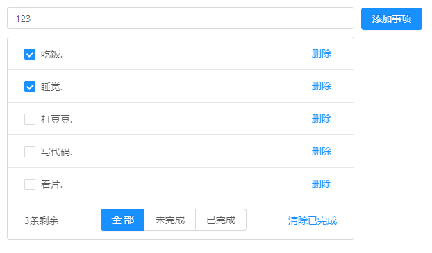
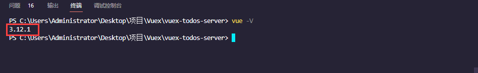
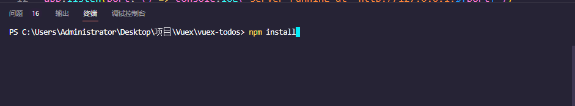
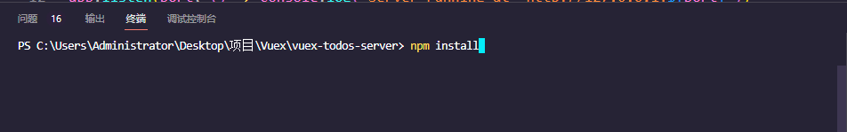
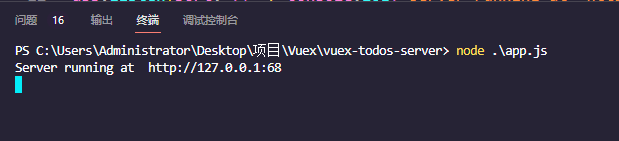

# vuex-todos

## 步骤①: 启动前端服务

> - 首先安装vue-cli脚手架，直接在任意目录执行`npm install vue-cil@3 -g `对应版本为3系列
> - 然后使用`vue -V`查看版本

`clone`或`download`项目后, 直接在对应的目录执行`npm install`, 直接把前端服务所需要的依赖全部安装, 然后再执行对应的`npm run serve`即可启动前端服务

## 步骤②: 本地打包浏览

### 1. 将`vuex-todos-server`解压

### 2. npm install安装依赖

### 3. 启动服务端  node app.js

> - 也可以自行在`vue ui`界面或者本地`vue-shop`路径下通过`npm run build`命令进行打包,将打包后的`dist`文件夹复制到`vue-shop-server`文件夹中即可

### 4. 浏览器打开`app.js`配置地址http://127.0.0.1:68浏览项目
